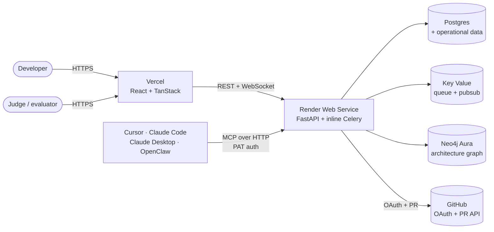

# CodeAtlas

> The AI-native living architecture platform. Turn any GitHub repository into a versioned architecture graph, then let AI coding agents evolve it safely.

[](LICENSE)
[](https://code-atlas-ai-henna.vercel.app)
[](https://codeatlas-api-r0e9.onrender.com/api/v1/warm)
[](../../issues/1)

Software architecture usually goes stale the moment it's documented. CodeAtlas keeps it live: source code is scanned into a canonical Architecture Graph, and every downstream artifact — documentation, diagrams, AI reasoning, refactor plans, coding-agent context — is grounded in that graph. AI never sees raw repositories; it sees an explainable, versioned model of your system.

---

## 👋 For hackathon judges

Everything you need to evaluate CodeAtlas in ~10 minutes:

| | |
|---|---|
| **Live app** | https://code-atlas-ai-henna.vercel.app |
| **Demo video (≤ 3 min)** | https://www.youtube.com/watch?v=zlBKdZrCyeY |
| **Pinned evaluation guide** | [Issue #1 — 10-minute test recipe, feature tour, MCP setup](../../issues/1) |
| **Backend health** | [`/api/v1/warm`](https://codeatlas-api-r0e9.onrender.com/api/v1/warm) · [`/api/v1/docs`](https://codeatlas-api-r0e9.onrender.com/api/v1/docs) |
| **Codex Session ID** | `019f80d5-58a2-70e0-ba16-54df678fecea` |
| **Submission narrative** | [`docs/00-overview/hackathon-submission.md`](docs/00-overview/hackathon-submission.md) |

Judging-criteria pointers: [Technological Implementation](backend/app/modules/mcp_http/) · [Design](apps/web/src/routes/architecture.tsx) · [Potential Impact](backend/app/modules/implementation/service.py) · [Quality of the Idea](docs/00-overview/hackathon-submission.md#what-it-does)

---

## What is CodeAtlas?

CodeAtlas is an **Architecture Intelligence Platform**. It connects to a GitHub repository, scans it into a **versioned Architecture Graph** (source facts in PostgreSQL, canonical graph in Neo4j), and exposes that graph as the single source of truth for:

- **Living documentation** — Markdown, Mermaid, Draw.io, and C4 artifacts generated from the graph, bound to a specific graph version.
- **Approval-gated implementation plans** — AI proposes changes against real graph nodes; owner/admin approves; CodeAtlas opens the pull request via the workspace's GitHub OAuth token.
- **Coding-agent integration via MCP** — Cursor / Claude Desktop / Claude Code / OpenClaw get architecture-aware context (`get_architecture_graph`, `create_implementation_plan`) without any exposure to raw source files.

The core bet: AI is more useful when it reasons over a structured, versioned model of a system than when it prompts raw code. Every response is explainable and traceable to a graph version.

---

## Architecture at a glance



**Layered design.** Parsers write source facts to Postgres. The graph module projects those facts into an immutable, versioned Architecture Graph in Neo4j. Documentation, diagrams, AI reasoning, plans, and the MCP bridge all consume that graph — never the raw repository. Full rationale: [`docs/02-architecture/system-architecture.md`](docs/02-architecture/system-architecture.md).

---

## Feature tour

### 🗂️ Repository intelligence
- GitHub OAuth connection with encrypted per-workspace access tokens.
- Background Celery scans; live progress streamed via authenticated WebSocket.
- Signed GitHub webhooks trigger automatic rescans on push.
- Immutable, versioned architecture graph — every scan produces a new graph version you can diff against.

### 📊 Graph-grounded outputs
- **Architecture graph explorer** with retractable panels, node inspector, focus mode (`F`), and keyboard shortcuts (`[`, `]`, `⌘\`, `Esc`).
- **Documentation, Mermaid, Draw.io, C4 artifacts** — generated from a specific graph version, so nothing drifts.
- **AI architecture chat** — grounded in graph context, not raw source.

### 🤖 AI-driven implementation
- **Approval-gated implementation plans** — draft → owner/admin approval → real GitHub PR opened via workspace OAuth token.
- **"Copy MCP bridge prompt"** action — hand a coding-agent-ready prompt to Cursor/Claude Code from any approved plan.
- **Workspace BYOK** — provide an OpenAI-compatible key/base URL/model per workspace, encrypted at rest, plaintext never returned by the API.

### 🔌 MCP coding bridge
- **Remote HTTP MCP** at `POST /api/v1/mcp` — no local install, no repo clone. Just a URL + a `cak_...` Personal Access Token.
- **Local stdio bridge** as a fallback for offline development.
- **Long-lived revocable Personal Access Tokens** minted at Settings → Agents.
- In-app setup for Cursor, Claude Desktop, Claude Code, OpenClaw.
- **Setup walkthrough:** [`docs/07-mcp/client-setup.md`](docs/07-mcp/client-setup.md).

### ⚙️ Operational essentials
- One-click Render Blueprint deployment ([`render.yaml`](render.yaml)).
- `/api/v1/warm` keep-alive endpoint for external uptime monitors.
- Neo4j Aura wake-retry (2s / 5s / 10s backoff) to survive free-tier hibernation.
- OpenTelemetry + Prometheus instrumentation.
- Structured `structlog` JSON logs.

---

## How we built this with Codex

CodeAtlas was built primarily inside a single Codex thread. Codex + GPT-5.6 scaffolded and iterated on:

- **The FastAPI monolith** — identity (JWT + GitHub OAuth + RBAC), repository ingestion + Celery scan pipeline, canonical Architecture Graph projection, artifact generation (Markdown / Mermaid / Draw.io / C4), approval-gated implementation plans, GitHub PR creation, and workspace BYOK.
- **The MCP integration surface** — stdio bridge (`backend/app/mcp_server.py`), Streamable HTTP transport (`backend/app/modules/mcp_http/`), and personal access tokens (`backend/app/modules/mcp_tokens/`).
- **The React / TanStack frontend** — workspace-aware app shell, retractable sidebars, architecture graph focus mode, implementation planner UX (approve + open-PR + copy-MCP-prompt), and the Agents page.
- **Operational glue** — `render.yaml` Blueprint, alembic migrations, inline Celery worker toggle, `/warm` keep-alive, Aura wake retry, and the MCP client-setup guide.

**Codex Session ID:** `019f80d5-58a2-70e0-ba16-54df678fecea`.
**Architectural rationale + full narrative:** [`docs/00-overview/hackathon-submission.md`](docs/00-overview/hackathon-submission.md).

At runtime, the AI layer uses the **OpenAI Responses API** with the versioned Architecture Graph as grounded context — AI stays downstream of parsing and graph construction so responses remain explainable and traceable to a specific graph version.

---

## Tech stack

| Layer | Stack |
|---|---|
| **Frontend** | React 19, TypeScript, Vite, TanStack Start + Router, Tailwind, Radix UI, ReactFlow, framer-motion |
| **API** | FastAPI, Python 3.13, SQLAlchemy 2, Pydantic v2, Alembic, structlog |
| **Auth** | JWT sessions, GitHub OAuth, PAT (`cak_...`) for MCP, per-workspace RBAC |
| **Workers** | Celery + Redis (Key Value), inline worker on free-tier deploy |
| **Data** | PostgreSQL 16 (+ pgvector for future embeddings), Neo4j Aura (architecture graph) |
| **AI** | OpenAI Responses API (BYOK or deployment key) |
| **Protocol** | Model Context Protocol — Streamable HTTP + stdio |
| **Observability** | OpenTelemetry, Prometheus, structured JSON logs |
| **Hosting** | Vercel (frontend), Render (API + Postgres + Key Value), Neo4j Aura, UptimeRobot keep-warm |
| **Container / CI** | Docker, docker-compose (dev), GitHub Actions |

---

## Getting started

### Try the hosted app (0 minutes)

Sign in at **https://code-atlas-ai-henna.vercel.app**. Connect any GitHub repo you can read. That's it.

### Run locally (5 minutes)

Requirements: Docker, Python 3.13+, [uv](https://docs.astral.sh/uv/), Node 20+ with [bun](https://bun.sh).

```powershell
# 1. Copy env template and configure secrets (JWT + Fernet + GitHub OAuth)
Copy-Item .env.example .env
# edit .env

# 2. Start Postgres, Neo4j, Redis, and the API
docker compose up --build

# 3. In a second terminal, start the canonical frontend
Set-Location apps/web
bun install --frozen-lockfile
bun run dev

# 4. In a third terminal, run backend tests
uv run pytest backend/tests
uv run ruff check backend alembic
```

The API applies Alembic migrations before startup. Vite prints the frontend URL when it's ready.

### Local demo mode (no GitHub OAuth)

For a quick local demo without configuring GitHub OAuth, docker-compose enables a development-only session endpoint. On the Settings page click **Use local demo session**. Only available when `CODEATLAS_ENVIRONMENT=development` **and** `CODEATLAS_ALLOW_DEVELOPMENT_LOGIN=true` — production startup rejects that combination.

---

## Deploy to production

The checked-in Compose stack is **local-only**. The supported hosted path uses the [`render.yaml`](render.yaml) Blueprint to provision the entire backend on Render's free tier (API + Postgres + Key Value), keeps the frontend on Vercel, and uses Neo4j Aura Free for the architecture graph. Step-by-step: [`docs/06-operations/production-deployment.md`](docs/06-operations/production-deployment.md).

Set up an external uptime monitor (e.g. UptimeRobot) hitting `/api/v1/warm` every 5 minutes to keep both Render and Aura Free out of hibernation.

---

## Documentation index

| Doc | Purpose |
|---|---|
| [`docs/00-overview/hackathon-submission.md`](docs/00-overview/hackathon-submission.md) | Full submission narrative — problem, approach, challenges, learnings |
| [`docs/00-overview/vision.md`](docs/00-overview/vision.md) | Product vision |
| [`docs/00-overview/roadmap.md`](docs/00-overview/roadmap.md) | Post-hackathon roadmap |
| [`docs/02-architecture/system-architecture.md`](docs/02-architecture/system-architecture.md) | System architecture reference |
| [`docs/05-api/openapi.md`](docs/05-api/openapi.md) | Public API surface |
| [`docs/05-codex/implementation-roadmap.md`](docs/05-codex/implementation-roadmap.md) | Implementation milestone status |
| [`docs/06-operations/production-deployment.md`](docs/06-operations/production-deployment.md) | Hosted deployment on Vercel + Render + Aura |
| [`docs/07-mcp/client-setup.md`](docs/07-mcp/client-setup.md) | Connect Cursor / Claude Desktop / Claude Code / OpenClaw |
| [`docs/07-mcp/protocol.md`](docs/07-mcp/protocol.md) | MCP transports (HTTP + stdio) and security model |
| [`docs/07-mcp/tools.md`](docs/07-mcp/tools.md) | Registered MCP tools |
| [Issue #1](../../issues/1) | Pinned judges' evaluation guide |

Live OpenAPI: [`https://codeatlas-api-r0e9.onrender.com/api/v1/docs`](https://codeatlas-api-r0e9.onrender.com/api/v1/docs).

---

## GitHub push refreshes

Configure a repository webhook at `https://<api-host>/api/v1/github/webhooks`, content type `application/json`, subscribed to push events, secret = `CODEATLAS_GITHUB_WEBHOOK_SECRET`. CodeAtlas verifies the raw-body `X-Hub-Signature-256` HMAC before processing. Non-deletion pushes to a connected repository's default branch queue a scan; the worker rebuilds the canonical graph and pushes progress to authenticated Architecture clients over WebSocket.

---

## License

CodeAtlas is released under the [MIT License](LICENSE).

---

_Built for the [OpenAI Build Week Challenge](https://openai.devpost.com/) with Codex + GPT-5.6._
