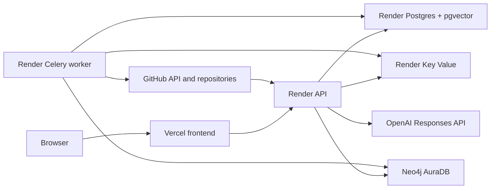

# Production deployment: Vercel, Render, and Neo4j Aura

This guide deploys the existing CodeAtlas frontend at Vercel and connects it to a hosted CodeAtlas backend. It is the recommended hosted configuration for the current implementation:

| Responsibility | Hosted service |
| --- | --- |
| Frontend | Vercel |
| Public API | Render Web Service |
| Background scans and graph projection | Render Background Worker |
| Operational database | Render Postgres with pgvector |
| Queue, rate limit, and event store | Render Key Value |
| Architecture Graph | Neo4j AuraDB |

The current `docker-compose.yml` is a **local-development stack**. Do not deploy it unchanged: it enables development login, includes development credentials, exposes local Neo4j ports, and does not define production persistence, TLS, or secret management.

## Architecture



Only the Vercel frontend and Render API are public. PostgreSQL, Redis, Neo4j credentials, metrics, and the Celery worker must not be exposed to browsers.

## Prerequisites

- A deployed Vercel frontend. The current production frontend is `https://code-atlas-ai-henna.vercel.app`.
- A Render account with access to Web Services, Background Workers, Postgres, and Key Value.
- A Neo4j AuraDB instance or an equivalent managed Neo4j deployment.
- A GitHub OAuth App and permission to create a repository webhook.
- An OpenAI API key when model-enhanced architecture chat is required. Without it, CodeAtlas remains available with deterministic graph-backed answers.
- A repository connected to Render so the API and worker can build from the same commit.

## 1. Provision data services

Create all data services in the same Render region as the API and worker.

### Neo4j AuraDB

Create an AuraDB instance and copy its connection details into the environment values below. Aura provides a secure `neo4j+s://...` URI, a username, and a password.

```dotenv
CODEATLAS_NEO4J_URI=neo4j+s://<instance-id>.databases.neo4j.io
CODEATLAS_NEO4J_USERNAME=neo4j
CODEATLAS_NEO4J_PASSWORD=<aura-password>
```

Keep the Aura credentials in Render secrets. Do not put them in the Vercel project.

### Render Postgres

Create a Render Postgres database. Copy its **internal** connection URL and change only its scheme:

```text
postgresql://...             # value supplied by Render
postgresql+psycopg://...     # value required by CodeAtlas
```

Set the second form as `CODEATLAS_DATABASE_URL`. Enable pgvector once using Render's PostgreSQL console or a trusted `psql` connection:

```sql
CREATE EXTENSION IF NOT EXISTS vector;
```

### Render Key Value

Create a Render Key Value instance. Copy its internal Redis-compatible URL unchanged into:

```dotenv
CODEATLAS_REDIS_URL=<render-key-value-url>
```

## 2. Create Render production secrets

Create a Render Environment Group named `codeatlas-production`. Link it to both the API and worker, then add the following values.

```dotenv
CODEATLAS_ENVIRONMENT=production
CODEATLAS_ALLOWED_ORIGINS=["https://code-atlas-ai-henna.vercel.app"]
CODEATLAS_WEB_APP_ORIGIN=https://code-atlas-ai-henna.vercel.app

CODEATLAS_DATABASE_URL=postgresql+psycopg://<user>:<url-encoded-password>@<postgres-host>:5432/<database>
CODEATLAS_NEO4J_URI=neo4j+s://<instance-id>.databases.neo4j.io
CODEATLAS_NEO4J_USERNAME=neo4j
CODEATLAS_NEO4J_PASSWORD=<aura-password>
CODEATLAS_REDIS_URL=<render-key-value-url>

CODEATLAS_JWT_SECRET=<random-secret>
CODEATLAS_JWT_ISSUER=codeatlas
CODEATLAS_JWT_AUDIENCE=codeatlas-web
CODEATLAS_GITHUB_TOKEN_ENCRYPTION_KEY=<fernet-key>
CODEATLAS_GITHUB_WEBHOOK_SECRET=<random-secret>
CODEATLAS_ALLOW_DEVELOPMENT_LOGIN=false
CODEATLAS_RATE_LIMIT_PER_MINUTE=120

CODEATLAS_GITHUB_CLIENT_ID=<github-oauth-client-id>
CODEATLAS_GITHUB_CLIENT_SECRET=<github-oauth-client-secret>
CODEATLAS_GITHUB_OAUTH_REDIRECT_URI=https://<render-api-name>.onrender.com/api/v1/auth/github/callback

CODEATLAS_AI_BASE_URL=https://api.openai.com/v1
CODEATLAS_AI_API_KEY=<openai-api-key>
CODEATLAS_AI_MODEL=gpt-4.1-mini
CODEATLAS_LOG_LEVEL=INFO
```

`CODEATLAS_ALLOWED_ORIGINS` is a JSON array, not a comma-separated string. Use the exact Vercel origin without a trailing slash. If a custom frontend domain is added later, append it to this array and update `CODEATLAS_WEB_APP_ORIGIN` if it becomes the canonical browser origin.

Generate secrets locally, then paste only the generated values into Render:

```powershell
openssl rand -base64 48
.\.venv\Scripts\python.exe -c "from cryptography.fernet import Fernet; print(Fernet.generate_key().decode())"
```

The production application refuses to start with a development JWT secret, absent PostgreSQL/Neo4j/Redis configuration, a missing GitHub token-encryption key, a missing webhook secret, or a development-login flag.

## 3. Deploy the Render API

1. In Render, select **New → Web Service** and connect the CodeAtlas repository.
2. Set the runtime to **Docker**.
3. Set **Dockerfile Path** to `docker/Dockerfile.api` and **Root Directory** to `.`.
4. Set the service port to `8000`; the image already binds Uvicorn to `0.0.0.0:8000`.
5. Set the health-check path to `/api/v1/ready`.
6. Link the `codeatlas-production` Environment Group.
7. For the initial deployment only, add this API-service-specific variable:

   ```dotenv
   CODEATLAS_RUN_MIGRATIONS=1
   ```

8. Deploy and wait for the migration log to reach Alembic head.

The API URL will be:

```text
https://<render-api-name>.onrender.com
```

Validate it before proceeding:

```text
GET https://<render-api-name>.onrender.com/api/v1/health
GET https://<render-api-name>.onrender.com/api/v1/ready
```

Both endpoints must return HTTP 200. After the first successful release, remove `CODEATLAS_RUN_MIGRATIONS` from the API service. For later releases, run `alembic upgrade head` once through a controlled pre-deploy command or a one-off administrative job before rolling API replicas.

## 4. Deploy the Celery worker

1. In Render, select **New → Background Worker** and connect the same repository.
2. Set the runtime to **Docker**.
3. Set **Dockerfile Path** to `docker/Dockerfile.api` and **Root Directory** to `.`.
4. Link the `codeatlas-production` Environment Group.
5. Set the Docker command to:

   ```text
   celery -A app.worker.celery_app worker --pool=solo --loglevel=INFO
   ```

6. Do not configure `CODEATLAS_RUN_MIGRATIONS=1` on the worker.
7. Deploy and confirm in worker logs that Celery connects to Redis.

The worker needs the database, Neo4j, Redis, and GitHub token-encryption settings because it handles private repository scans and architecture graph projection.

## 5. Configure GitHub OAuth and webhooks

Create or update the GitHub OAuth App:

| Setting | Value |
| --- | --- |
| Homepage URL | `https://code-atlas-ai-henna.vercel.app` |
| Authorization callback URL | `https://<render-api-name>.onrender.com/api/v1/auth/github/callback` |

Create a GitHub webhook for connected repositories:

| Setting | Value |
| --- | --- |
| Payload URL | `https://<render-api-name>.onrender.com/api/v1/github/webhooks` |
| Content type | `application/json` |
| Secret | The exact `CODEATLAS_GITHUB_WEBHOOK_SECRET` value stored in Render |
| Events | Push events |

The GitHub `ping` event should return HTTP 202. CodeAtlas verifies the raw-body `X-Hub-Signature-256` signature before parsing the request, and only queues a scan for eligible default-branch push events.

## 6. Connect the Vercel frontend

In the Vercel project, open **Settings → Environment Variables** and add this Production variable:

```dotenv
VITE_CODEATLAS_API_URL=https://<render-api-name>.onrender.com
```

Redeploy Vercel after saving the variable. Vite injects `VITE_*` values during the frontend build; changing the setting does not alter an existing deployment.

The Vercel frontend must not receive any database, Redis, Neo4j, GitHub client-secret, token-encryption, webhook, JWT, or OpenAI API secret. It needs only the public API URL.

## 7. Production acceptance test

1. Open `https://code-atlas-ai-henna.vercel.app`.
2. Open **Settings** and authenticate through GitHub OAuth.
3. Connect a public GitHub repository.
4. Trigger a repository scan.
5. Confirm that the worker completes the scan and a graph version is created.
6. Open the Architecture page and confirm graph data appears.
7. Generate a documentation or diagram artifact.
8. Ask an architecture question and confirm a graph version and citations are returned.
9. Push a change to the repository default branch and verify the signed GitHub webhook requests a refresh scan.

## Troubleshooting

| Symptom | Likely cause and resolution |
| --- | --- |
| Browser calls `localhost:8000` | `VITE_CODEATLAS_API_URL` is absent or Vercel was not redeployed. |
| Browser shows a CORS error | Add the exact Vercel origin to `CODEATLAS_ALLOWED_ORIGINS`; do not add a trailing slash. |
| `/api/v1/ready` returns 503 | Check the Render Postgres URL scheme, Aura URI/credentials, and Render Key Value URL. |
| API fails on startup | Read the first Pydantic configuration error; production configuration validation identifies the missing required value. |
| Worker starts but scans do not run | Confirm the worker uses the same `CODEATLAS_REDIS_URL` as the API and that the Celery command matches this guide. |
| GitHub sign-in fails | Ensure the callback URL exactly matches both GitHub and `CODEATLAS_GITHUB_OAUTH_REDIRECT_URI`. |
| GitHub webhooks fail | Ensure the webhook payload URL is HTTPS and its secret exactly matches `CODEATLAS_GITHUB_WEBHOOK_SECRET`. |
| Aura cannot connect | Use the exact `neo4j+s://...` URI copied from Aura and confirm outbound Bolt connectivity is allowed. |

## Security and operations

- Never commit the Render Environment Group values, Vercel secrets, or Aura credentials.
- Keep PostgreSQL, Redis, and Neo4j private. Only the API should accept public browser traffic.
- Restrict `/metrics` to monitoring infrastructure.
- Back up PostgreSQL before schema-changing releases and retain Neo4j Aura snapshots.
- Monitor readiness failures, API 5xx rates, Celery retry growth, scan failures, Neo4j connectivity, and OpenAI API failures.
- Build and test each release before deployment:

  ```powershell
  uv run ruff check backend alembic
  uv run pytest backend/tests
  docker build -f docker/Dockerfile.api -t codeatlas-api:ci .
  ```

## Future production infrastructure

The repository does not yet contain a Render Blueprint, Terraform/Bicep, Kubernetes manifests, Helm chart, or a provider-specific frontend configuration file. Those should be added before moving from the recommended managed-service setup to a repeatable multi-environment enterprise deployment.
