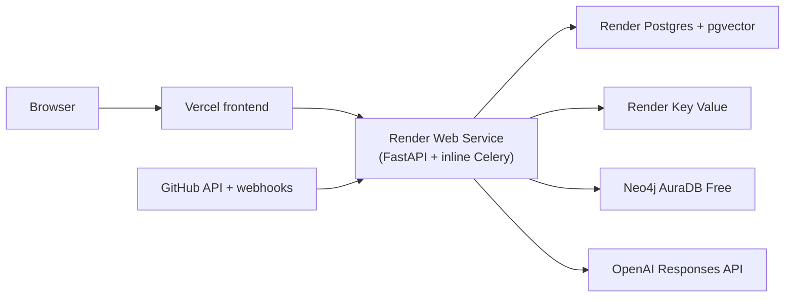

# Production deployment: Render backend + Vercel frontend

This guide runs the CodeAtlas backend **entirely on Render's free tier** and connects it to the existing Vercel frontend. It replaces the earlier three-provider layout: everything except Neo4j and the frontend now lives in one Render team, driven by the `render.yaml` Blueprint at the repository root.

| Responsibility | Hosted service |
| --- | --- |
| Frontend | Vercel (already deployed) |
| Public API + inline Celery worker | Render Web Service (free) |
| Operational database | Render Postgres (free) with pgvector |
| Queue, rate limit, event store | Render Key Value (free) |
| Architecture Graph | Neo4j AuraDB Free |

The Celery worker runs **inside the API container** because Render's free tier does not include Background Workers. `CODEATLAS_RUN_INLINE_WORKER=1` in the Blueprint tells `docker/entrypoint.sh` to launch `celery worker` in the background before Uvicorn starts.

The `docker-compose.yml` in the repo is a **local-development stack** — do not deploy it unchanged.

## Architecture



Only the Vercel frontend and the Render Web Service accept public traffic. Postgres, Key Value, Neo4j credentials, and the inline worker must stay private.

## Free-tier caveats

Understand these before you ship:

- **Cold starts.** The Web Service spins down after ~15 minutes of no HTTP traffic. The first request after a spin-down wakes it in ~30-60 seconds. If a spin-down occurs while a scan is queued in Redis, the inline worker resumes the task only when the next request wakes the service.
- **Render Postgres Free expires after 90 days.** Plan to upgrade to a paid Postgres plan or dump/restore into a fresh free instance before the expiry.
- **Key Value Free is ~25 MB.** Enough for the Celery queue and rate-limit counters at demo scale.
- **Background Workers require a paid plan.** This guide sidesteps that by running the worker inline. If you need durable async processing (multiple replicas, retries surviving restarts), promote the worker to its own Render Background Worker on the Starter plan and set `CODEATLAS_RUN_INLINE_WORKER=0` on the Web Service.
- **Neo4j Aura Free hibernates on 3-day idle**, and returns transient `Neo.ClientError.Security.Unauthorized` during resume. CodeAtlas mitigates this two ways: (a) the Neo4j graph driver retries auth errors with 2s / 5s / 10s backoff, (b) `/api/v1/warm` exercises Neo4j so an external uptime monitor keeps Aura alive. Neo4j is a **soft** dependency in `/api/v1/ready` — Postgres and Redis are hard-required, but Aura hibernation cannot block a redeploy. Aura Free is capped at 200k nodes / 400k relationships.

## Prerequisites

- A deployed Vercel frontend (e.g. `https://code-atlas-ai-henna.vercel.app`).
- A Render account with billing set to the free plan.
- A Neo4j AuraDB Free instance.
- A GitHub OAuth App and permission to create a repository webhook.
- An OpenAI API key when AI-enhanced chat is required. Without it, CodeAtlas serves deterministic graph-backed answers.
- This repository connected to Render (Blueprint requires a linked Git repo).

## 1. Provision Neo4j AuraDB Free

Create an AuraDB Free instance in the region closest to Render's Oregon region. Copy:

```dotenv
CODEATLAS_NEO4J_URI=neo4j+s://<instance-id>.databases.neo4j.io
CODEATLAS_NEO4J_USERNAME=neo4j
CODEATLAS_NEO4J_PASSWORD=<aura-password>
```

Keep these in Render only. Do not put them in the Vercel project.

## 2. Apply the Render Blueprint

The repository ships a `render.yaml` at the root that provisions the entire backend in one apply.

1. In Render, open **New +** -> **Blueprint** and connect this repository.
2. Render reads `render.yaml` and shows the resources it will create:
   - `codeatlas-postgres` (Postgres, free, PG 16)
   - `codeatlas-redis` (Key Value, free)
   - `codeatlas-api` (Web Service, Docker, free)
3. Click **Apply**. Render creates all three services in a single environment.
4. Wait for the initial `codeatlas-api` build. The first deploy runs Alembic (`CODEATLAS_RUN_MIGRATIONS=1`) and then starts Uvicorn plus the inline Celery worker.

The Blueprint wires the datastore URLs automatically:

- `CODEATLAS_DATABASE_URL` from `codeatlas-postgres.connectionString`
- `CODEATLAS_REDIS_URL` from `codeatlas-redis.connectionString`
- `CODEATLAS_JWT_SECRET` generated by Render

Postgres exposes `connectionString` as `postgresql://...`. The application normalizes that to `postgresql+psycopg://...` on load; no manual editing required.

## 3. Fill in the sync:false environment variables

The Blueprint declares these with `sync: false`, meaning Render will prompt you (or leave them blank) rather than syncing them from source control. Open the `codeatlas-api` service -> **Environment** and set:

```dotenv
CODEATLAS_WEB_APP_ORIGIN=https://code-atlas-ai-henna.vercel.app
CODEATLAS_ALLOWED_ORIGINS=["https://code-atlas-ai-henna.vercel.app"]

CODEATLAS_NEO4J_URI=neo4j+s://<instance-id>.databases.neo4j.io
CODEATLAS_NEO4J_PASSWORD=<aura-password>

CODEATLAS_GITHUB_CLIENT_ID=<github-oauth-client-id>
CODEATLAS_GITHUB_CLIENT_SECRET=<github-oauth-client-secret>
CODEATLAS_GITHUB_OAUTH_REDIRECT_URI=https://<render-api-name>.onrender.com/api/v1/auth/github/callback
CODEATLAS_GITHUB_WEBHOOK_SECRET=<random-secret>

CODEATLAS_GITHUB_TOKEN_ENCRYPTION_KEY=<fernet-key>
CODEATLAS_AI_KEY_ENCRYPTION_KEY=<fernet-key>

CODEATLAS_AI_API_KEY=<openai-api-key>   # optional
```

`CODEATLAS_ALLOWED_ORIGINS` is a JSON array (no trailing slash). Generate the two secrets and two Fernet keys locally, then paste only the generated values into Render:

```powershell
# Random webhook secret
python -c "import secrets; print(secrets.token_urlsafe(48))"
# Fernet key
.\.venv\Scripts\python.exe -c "from cryptography.fernet import Fernet; print(Fernet.generate_key().decode())"
```

The production configuration refuses to start with a development JWT secret, missing Postgres/Neo4j/Redis, missing Fernet keys, missing webhook secret, or `CODEATLAS_ALLOW_DEVELOPMENT_LOGIN=true`. If the boot fails, read the first Pydantic error — it names the missing key.

## 4. Verify the API

The API URL is `https://<render-api-name>.onrender.com`. Confirm:

```text
GET https://<render-api-name>.onrender.com/api/v1/health
GET https://<render-api-name>.onrender.com/api/v1/ready
GET https://<render-api-name>.onrender.com/api/v1/warm
```

- `/health` — liveness (200 as long as the process is running).
- `/ready` — 200 if Postgres and Redis are reachable. Neo4j is soft; its status is only logged.
- `/warm` — **always** returns 200 with a per-dep status. This is the endpoint your uptime monitor should hit; the body body reports which deps are green.

After the first successful release, set `CODEATLAS_RUN_MIGRATIONS=0` on the service. For subsequent schema changes, either re-enable the flag for one deploy or run `alembic upgrade head` from a one-off Render Shell before rolling the new image.

## 5. Configure GitHub OAuth + webhook

GitHub OAuth App:

| Setting | Value |
| --- | --- |
| Homepage URL | `https://code-atlas-ai-henna.vercel.app` |
| Authorization callback URL | `https://<render-api-name>.onrender.com/api/v1/auth/github/callback` |

Repository webhook:

| Setting | Value |
| --- | --- |
| Payload URL | `https://<render-api-name>.onrender.com/api/v1/github/webhooks` |
| Content type | `application/json` |
| Secret | The exact `CODEATLAS_GITHUB_WEBHOOK_SECRET` value |
| Events | Push events |

GitHub's `ping` event should return HTTP 202. Signature verification runs against the raw body before parsing, and only default-branch pushes queue a scan.

## 6. Point the Vercel frontend at Render

In the Vercel project, **Settings -> Environment Variables**, set for Production:

```dotenv
VITE_CODEATLAS_API_URL=https://<render-api-name>.onrender.com
```

Redeploy Vercel — Vite injects `VITE_*` values at build time, so an existing deployment will not pick up the change until a redeploy.

The frontend must not receive any database, Redis, Neo4j, GitHub client secret, token-encryption, webhook, JWT, or OpenAI key. It needs only the public API URL.

## 7. Set up the keep-warm cron

Register an external uptime monitor (UptimeRobot, cron-job.org, or similar) to hit `/api/v1/warm` every **5 minutes**. This does two things at once:

- Keeps the Render Web Service out of the 15-minute idle spin-down.
- Exercises the Neo4j driver so Aura Free never accumulates enough idle to hibernate.

UptimeRobot's free tier supports 5-minute intervals with unlimited HTTP monitors.

## 8. Wire the MCP coding bridge (optional but recommended)

CodeAtlas ships MCP for Cursor / Claude Desktop / Claude Code / OpenClaw over two transports:

- **Streamable HTTP** at `POST /api/v1/mcp` — remote, no client install. Authenticate with a **Personal Access Token** (`cak_...`) minted in the UI at Settings → Agents.
- **Local stdio** (`app.mcp_server`) — same tools, fallback for offline development.

Full walkthrough: [MCP client setup](../07-mcp/client-setup.md). PATs live in the `mcp_personal_access_tokens` table created by alembic migration `20260802_01`; they are SHA-256 hashed at rest and can be revoked from the same UI.

## 9. Acceptance test

1. Open the Vercel URL.
2. Sign in with GitHub OAuth.
3. Connect a public GitHub repository.
4. Trigger a repository scan.
5. Watch `codeatlas-api` logs — the inline Celery worker should pick up the task, complete the scan, and produce a graph version.
6. Open the Architecture page and confirm graph data appears.
7. Generate a documentation or diagram artifact.
8. Ask an architecture question; confirm citations return.
9. Create an implementation plan → approve → **Open pull request…** and confirm the PR appears on GitHub.
10. Go to Settings → Agents → **Generate MCP token** → run the copied config against Cursor or `claude mcp add`; verify `get_architecture_graph` returns real graph data.
11. Push to the repo's default branch and confirm the signed webhook triggers a refresh scan.

## Troubleshooting

| Symptom | Likely cause and resolution |
| --- | --- |
| Browser calls `localhost:8000` | `VITE_CODEATLAS_API_URL` missing on Vercel, or Vercel not redeployed after setting it. |
| CORS error in browser | Add the exact Vercel origin to `CODEATLAS_ALLOWED_ORIGINS` (JSON array, no trailing slash). |
| `/api/v1/ready` returns 503 | Postgres or Redis unreachable. Neo4j alone will NOT cause a 503 — its status is only logged. Check Blueprint-wired connectionStrings first. |
| `/api/v1/warm` reports `neo4j: AuthError` | Aura is either paused or the password rotated. Resume the instance or reset the password on the Aura console and update `CODEATLAS_NEO4J_PASSWORD`. |
| MCP tool returns `isError` with a Neo4j auth message | Same cause as above. The bridge already retries 2s / 5s / 10s before surfacing; sustained failure means credentials, not hibernation. |
| API fails on startup | Read the first Pydantic error; production validation names the missing required value. |
| Scans queue but never complete | Confirm `CODEATLAS_RUN_INLINE_WORKER=1` is set on `codeatlas-api` and the service is not asleep. |
| Cold-start latency | Expected on the free plan (~30-60s after 15 min idle). Set up the `/warm` uptime monitor (step 7) to eliminate it, or upgrade the Web Service to Starter. |
| GitHub sign-in fails | Callback URL must match GitHub and `CODEATLAS_GITHUB_OAUTH_REDIRECT_URI` exactly. |
| Webhooks fail | Payload URL must be HTTPS and its secret must match `CODEATLAS_GITHUB_WEBHOOK_SECRET`. |
| Aura cannot connect | Use the exact `neo4j+s://...` URI Aura provides — Aura sometimes rotates the URI hostname when resumed from long pauses. |
| Deploys keep failing on Neo4j auth | The `/ready` probe used to require Neo4j and killed every deploy while Aura was asleep. That is fixed: Neo4j is a soft dep. If you still see the failure, your `codeatlas-api` deploy predates `feat(health): Neo4j is a soft dep in /ready`. |

## Promoting off the free tier

When free-tier limits start to bite, the smallest paid upgrades are:

- **Web Service -> Starter** removes cold starts.
- **Postgres -> Starter** avoids the 90-day expiry and lifts the storage cap.
- **Split the worker back out** — add a Render Background Worker on Starter that runs `celery -A app.worker.celery_app worker --pool=solo --loglevel=INFO`, share the same environment group, and set `CODEATLAS_RUN_INLINE_WORKER=0` on the Web Service.
- **Neo4j -> Aura Professional** for larger graphs.

## Security and operations

- Never commit Render env values, Vercel secrets, or Aura credentials.
- Keep Postgres, Key Value, and Neo4j private. Only the Web Service accepts public browser traffic.
- Restrict `/metrics` to monitoring infrastructure.
- Back up Postgres before schema-changing releases and retain Aura snapshots.
- Monitor readiness failures, API 5xx rates, Celery retry growth, scan failures, Neo4j connectivity, and OpenAI API failures.
- Build and test each release before deployment:

  ```powershell
  uv run ruff check backend alembic
  uv run pytest backend/tests
  docker build -f docker/Dockerfile.api -t codeatlas-api:ci .
  ```
